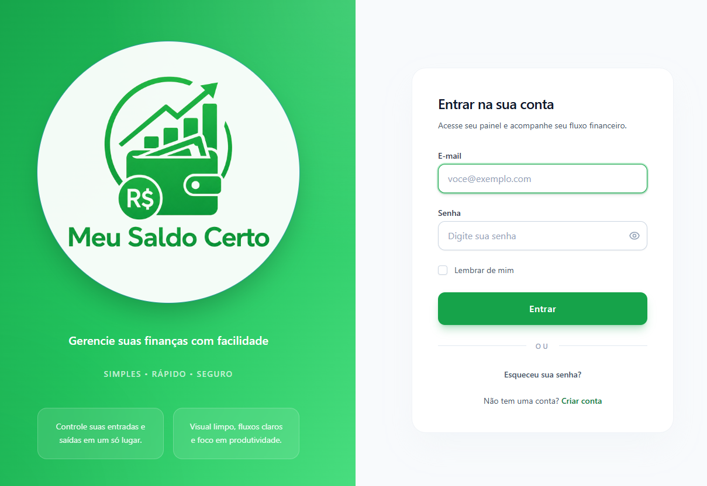
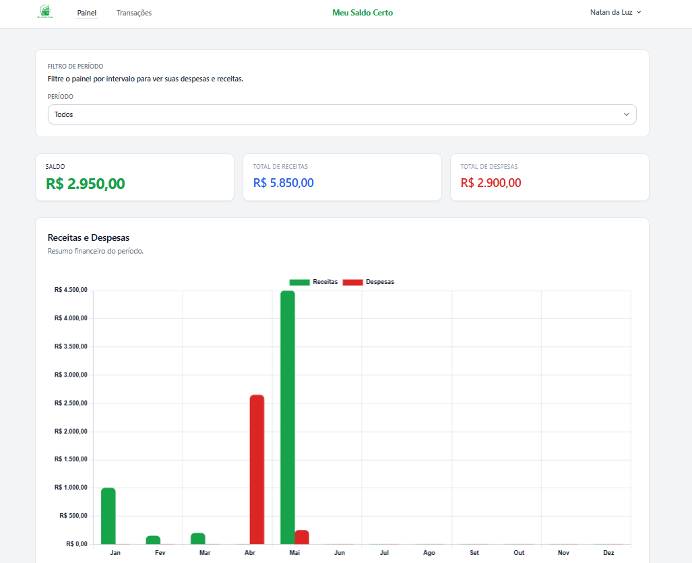
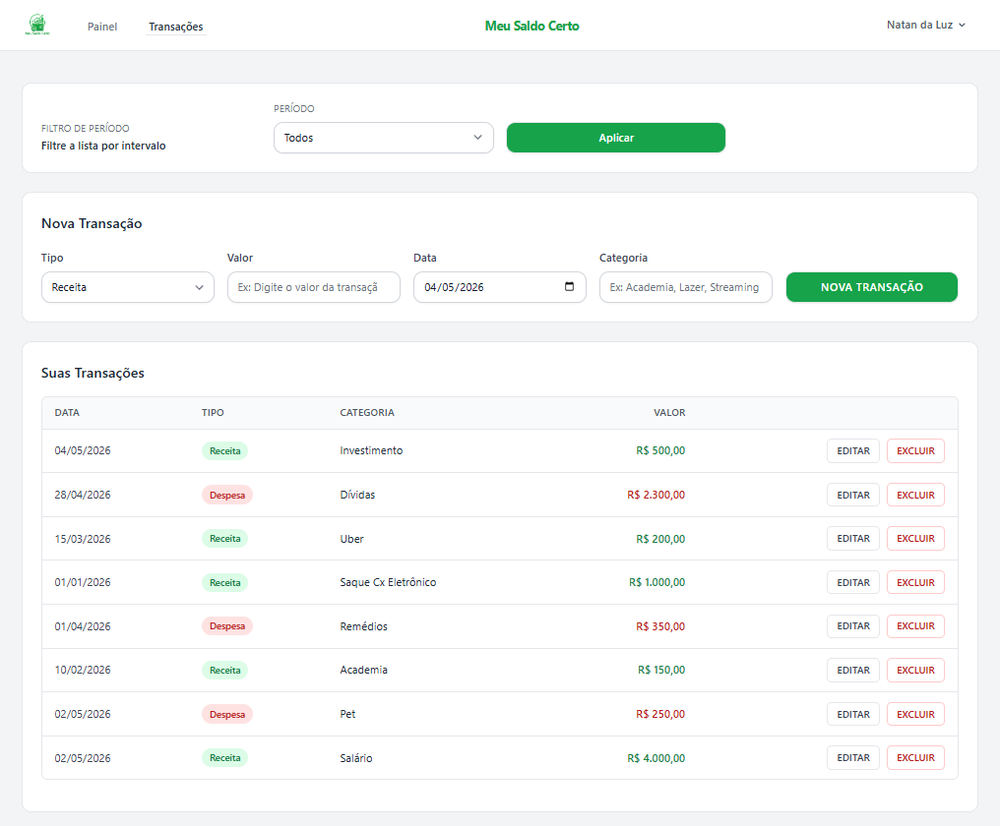
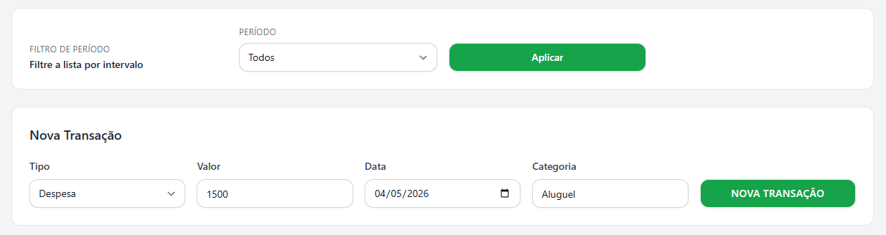

# Meu Saldo Certo 💼

é um Sistema financeiro desenvolvido em Laravel para controle de receitas, despesas, categorias e saldo por usuário autenticado. O projeto foi estruturado para funcionar como uma apresentação de portfólio moderna, com foco em clareza visual, organização de código, boas práticas e experiência de uso consistente.

<p align="center">
  
  
  
  
  
</p>

<p align="center">
  <a href="https://github.com/NatanLuz/meu-saldo-certo">
    
  </a>
  <a href="https://meu-saldo-certo-production.up.railway.app">
    
  </a>
</p>

---

## Sumário

- [Visão Geral](#visão-geral-)
- [Objetivo do Projeto](#objetivo-do-projeto-)
- [Diferenciais](#diferenciais-)
- [Funcionalidades](#funcionalidades-principais-)
- [Regras de Negócio](#regras-de-negócio-)
- [Arquitetura](#arquitetura-e-organização-)
- [Tecnologias e Conceitos Aplicados](#tecnologias-e-conceitos-aplicados-)
- [Estrutura do Projeto](#estrutura-do-projeto-)
- [Como Executar](#como-executar-localmente-)
- [Deploy / Aplicação Online](#deploy--aplicação-online-)
- [Screenshots](#screenshots-do-projeto-)
- [Banco de Dados](#banco-de-dados-)
- [Aprendizados](#aprendizados-no-projeto-)
- [Possíveis Melhorias Futuras](#possíveis-melhorias-futuras-)
- [Autor](#autor-)
- [Licença](#licença)

## Visão Geral ✨

O Meu Saldo Certo permite registrar, consultar e analisar movimentações financeiras de forma simples e objetiva. A aplicação simula um produto real, com navegação intuitiva, separação clara de responsabilidades e interface organizada para leitura rápida dos dados.

A experiência foi pensada para cobrir o fluxo completo de um sistema financeiro moderno: autenticação, cadastro de categorias, controle de transações, filtros por período, dashboard analítico e isolamento de dados por usuário.

## Objetivo do Projeto 🎯

O objetivo deste projeto é demonstrar a construção de uma aplicação financeira completa com Laravel, desde a modelagem do domínio até a entrega final em produção. A proposta é evidenciar domínio de boas práticas, organização de arquitetura, responsividade, clareza de interface e preparo para deploy.

Além da parte funcional, o projeto foi desenhado como peça de portfólio para recrutadores, com foco em apresentação profissional, narrativa de produto e consistência visual.

## Diferenciais 🚀

- Dashboard com consolidação dinâmica de dados financeiros.
- Gráfico analítico para leitura rápida da evolução financeira.
- Filtro por período para análise das movimentações.
- CRUD completo de transações com fluxo organizado.
- Categorias vinculadas a cada usuário autenticado.
- Implementação de multi-tenant simples com isolamento por usuário.
- Validação centralizada com Form Requests.
- Regras de autorização com Policies.
- Seeders para facilitar testes e demonstração local.
- Interface responsiva, limpa e com foco em legibilidade.

## Funcionalidades Principais 🧩

- Login, registro e recuperação de senha.
- Dashboard financeiro com visão consolidada de receitas, despesas e saldo.
- Gráfico analítico com apoio visual para tomada de decisão.
- Cadastro, edição, listagem e exclusão de transações.
- Classificação das movimentações entre receitas e despesas.
- Associação de categorias por usuário autenticado.
- Filtros por período para análise histórica.
- Regras de autorização com Policies.
- Estrutura preparada com seed inicial para uso local.

## Regras de Negócio 📌

- Toda transação deve estar vinculada a uma categoria.
- Categorias pertencem exclusivamente ao usuário autenticado.
- Uma transação deve ser classificada como receita ou despesa.
- O tipo da categoria precisa ser compatível com o tipo da transação.
- Cada usuário pode visualizar apenas os seus próprios dados.

## Arquitetura e Organização 🏗️

O projeto segue o padrão MVC do Laravel com separação clara de responsabilidades:

- Controllers: orquestram o fluxo entre validação, models e views.
- Form Requests: centralizam regras de validação e mantêm os controllers enxutos.
- Policies: controlam autorização por usuário.
- Models: concentram relacionamentos e parte das regras de domínio.
- Blade Components: melhoram reutilização e consistência visual.
- TailwindCSS: oferece interface responsiva e organizada.

Essa estrutura facilita manutenção, evolução e leitura do código em cenários reais de produto, além de tornar o projeto mais sólido para escalabilidade futura.

## Tecnologias e Conceitos Aplicados 🛠️

- Laravel 12
- PHP 8.2+
- Blade
- TailwindCSS
- Alpine.js
- Chart.js
- Vite
- SQLite
- Laravel Breeze
- MVC
- Policies
- Form Requests
- Blade Components
- Multi-tenant simples
- Seeders

## Estrutura do Projeto 📂

```text
app/
  Http/
    Controllers/
    Requests/
  Models/
  Policies/
  Support/
bootstrap/
config/
database/
  migrations/
  seeders/
public/
resources/
  css/
  js/
  views/
routes/
tests/
```

## Como Executar Localmente 💻

### Pré-requisitos

- PHP 8.2 ou superior
- Composer
- Node.js e npm
- SQLite

### Instalação

```bash
git clone https://github.com/NatanLuz/meu-saldo-certo.git
cd meu-saldo-certo
composer install
npm install
cp .env.example .env
php artisan key:generate
php artisan migrate --seed
```

O seeder cria um usuário de teste e dados iniciais para facilitar a validação local do sistema.

### Execução

Abra dois terminais e execute:

```bash
npm run dev
```

```bash
php artisan serve --host=127.0.0.1 --port=8000
```

Depois acesse:

- http://127.0.0.1:8000

## Testes ✅

Para executar a suíte de testes:

```bash
php artisan test
```

## Deploy / Aplicação Online 🌍

A aplicação está hospedada no Railway e pode ser acessada no link abaixo:

- https://meu-saldo-certo-production.up.railway.app

O deploy foi preparado para evidenciar o projeto em ambiente real, reforçando a proposta de portfólio e permitindo navegação completa sem necessidade de instalação local.

## Screenshots do Projeto 🖼️

A pasta screenshots foi incluída para documentar visualmente as principais telas e reforçar a apresentação do sistema. Os arquivos foram padronizados para nomes sem acentos e em minúsculas, visando compatibilidade entre sistemas de arquivos.

### Login

Tela de autenticação para entrada na aplicação.



### Dashboard

Resumo financeiro com gráfico e filtro por período.



### Transações

Lista de movimentações com ações de cadastro, edição e exclusão.



### Nova Transação

Formulário para registrar uma nova movimentação financeira.



## Banco de Dados 🗄️

Entidades principais:

- users
- categories
- transactions

Relacionamentos:

- User 1:N Transactions
- User 1:N Categories
- Category 1:N Transactions

## Aprendizados no Projeto 📚

- Estruturação de uma aplicação Laravel com foco em manutenção e escalabilidade.
- Aplicação prática de validação com Form Requests e autorização com Policies.
- Organização de uma interface financeira com foco em clareza de dados.
- Uso de gráfico analítico para transformar dados brutos em informação útil.
- Construção de um fluxo simples de multi-tenant por usuário.
- Preparação de projeto com deploy e documentação mais próxima de um produto real.

## Possíveis Melhorias Futuras 🔮

- Exportação de relatórios em PDF e CSV.
- Filtros mais avançados por categoria, tipo e intervalo customizado.
- Metas financeiras e indicadores de evolução mensal.
- Alertas de gastos acima do planejado.
- Nova camada de perfil para personalização da experiência.
- Evolução do gráfico com mais recortes analíticos.
- Suporte a múltiplas moedas.
- Testes automatizados adicionais cobrindo mais cenários de negócio.

## Autor 👨‍💻

Natan Da Luz

- E-mail: [natandaluz01@gmail.com](mailto:natandaluz01@gmail.com)
- LinkedIn: [natandaluzdesenvolvedor](https://www.linkedin.com/in/natandaluzdesenvolvedor/)

## Licença

Projeto licenciado sob a MIT License.
