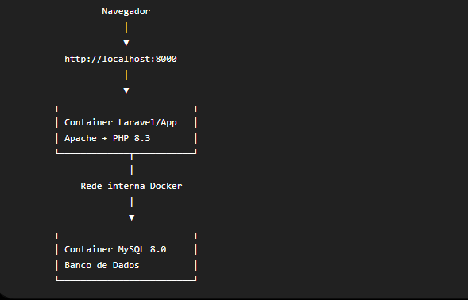
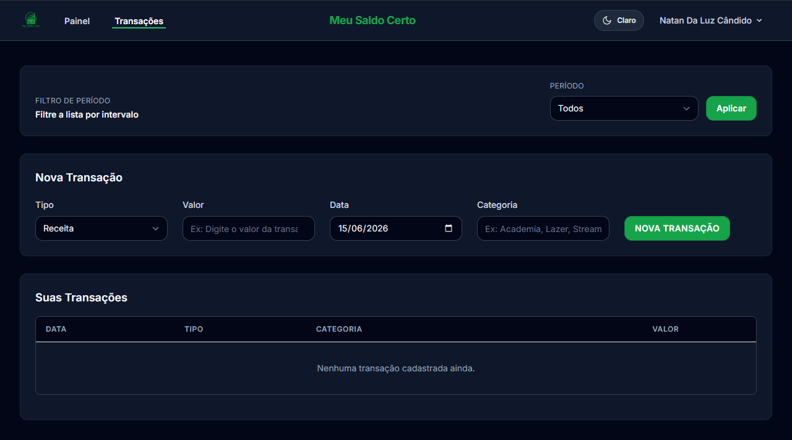
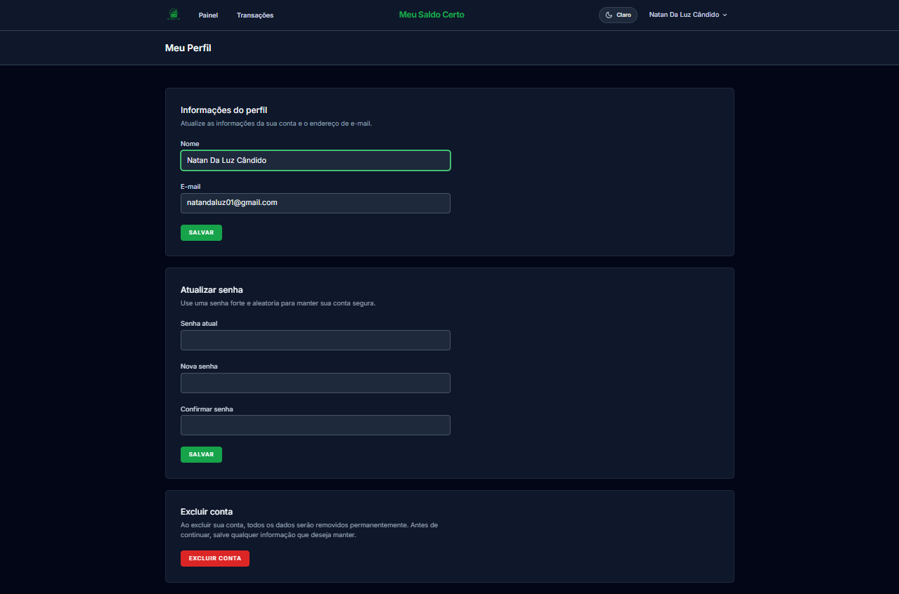

Sistema Web de controle financeiro pessoal desenvolvido em Laravel, permitindo o gerenciamento de receitas, despesas, categorias e acompanhamento financeiro por meio de dashboard com gráficos.

## Meu Saldo Certo 

<p align="center">
  Um Sistema Financeiro para gerenciamento de receitas, despesas, categorias e saldo por usuário autenticado, simples prático e rápido !
</p>


<p align="center">
  
  
  
  
  
</p>

## Sobre o Projeto

O **Meu Saldo Certo** é uma aplicação web para controle financeiro pessoal. O sistema permite registrar movimentações financeiras, classificar receitas e despesas por categorias, acompanhar o saldo atual e visualizar dados consolidados em um dashboard.

O projeto foi desenvolvido como aplicação de portfólio profissional, com foco em organização de código, uso adequado dos recursos do Laravel, separação de responsabilidades e preparação para execução em ambiente Docker.

## Funcionalidades

- Cadastro e autenticação de usuários com Laravel Breeze.
- Login e logout.
- Dashboard financeiro.
- Visualização de receitas, despesas e saldo atual.
- Gráficos financeiros utilizando Chart.js.
- CRUD de receitas.
- CRUD de despesas.
- Cadastro de categorias associadas às movimentações.
- Filtros por período.
- Paginação.
- Validação com Form Requests.
- Autorização com Policies.
- Separação de dados por usuário autenticado.
- Modelagem de banco de dados relacional.

## Stack Do Projeto

- PHP
- Laravel 
- MySQL
- Docker
- Docker Compose
- Apache
- Composer
- Node.js
- Vite
- Blade
- Tailwind CSS
- JavaScript
- Chart.js

## Arquitetura do Projeto

O projeto utiliza a arquitetura MVC do Laravel, separando responsabilidades entre rotas, controllers, models, views, requests, policies e migrations.



## Organização Técnica

- `app/Http/Controllers`: controllers responsáveis pelos fluxos web.
- `app/Http/Requests`: validações centralizadas com Form Requests.
- `app/Models`: entidades principais da aplicação.
- `app/Policies`: regras de autorização por usuário.
- `database/migrations`: estrutura relacional do banco de dados.
- `resources/views`: telas Blade da aplicação.
- `resources/js` e `resources/css`: assets compilados pelo Vite.
- `routes/web.php`: definição das rotas web protegidas por autenticação.

## Pré-requisitos para o projeto

- Docker
- Docker Compose
- Git

### 1. Clonar o Projeto

```bash
git clone https://github.com/NatanLuz/meu-saldo-certo.git
cd meu-saldo-certo
```

### 2. Configurar o Arquivo `.env`

Copie o arquivo de exemplo:

```bash
cp .env.example .env
```

Windows PowerShell:

```powershell
Copy-Item .env.example .env
```

Para executar com Docker Compose, configure o banco usando o nome do serviço MySQL:

```env
DB_CONNECTION=mysql
DB_HOST=mysql
DB_PORT=3306
DB_DATABASE=meu_saldo_certo
DB_USERNAME=meu_saldo_certo
DB_PASSWORD=secret
```

Também é recomendado manter:

```env
SESSION_DRIVER=database
CACHE_STORE=database
QUEUE_CONNECTION=database
```

### 3. Subir os Containers

```bash
docker compose up -d --build
```

Esse comando cria e inicia:

- container Laravel + Apache + PHP;
- container MySQL 8;
- volume persistente para o banco;
- rede interna para comunicação entre aplicação e banco.

### 4. Executar as Migrations do projeto

```bash
docker compose exec app php artisan migrate
```

### 5. Criar Link de Storage, se Necessário

```bash
docker compose exec app php artisan storage:link
```

### 6. Criar Usuário Inicial

O cadastro pode ser feito pela própria tela da aplicação acessando o link.

Caso seja necessário criar um usuário de teste pelo terminal, o projeto possui o comando:

```bash
docker compose exec app php artisan make:test-user
```

### 7. Acessar a Aplicação

```text
http://localhost:8000
```

## Variáveis de Ambiente

Principais variáveis utilizadas para conexão com o MySQL:

```env
DB_CONNECTION=mysql
DB_HOST=mysql
DB_PORT=3306
DB_DATABASE=meu_saldo_certo
DB_USERNAME=meu_saldo_certo
DB_PASSWORD=secret
```

Descrição:

- `DB_CONNECTION`: driver de banco utilizado pelo Laravel.
- `DB_HOST`: host do banco. No Docker Compose, deve ser o nome do serviço `mysql`.
- `DB_PORT`: porta interna do MySQL no container.
- `DB_DATABASE`: nome do banco de dados da aplicação.
- `DB_USERNAME`: usuário utilizado pela aplicação.
- `DB_PASSWORD`: senha do usuário da aplicação.

Em produção, esses valores devem ser definidos no provedor de hospedagem, sem versionar credenciais reais no repositório.

# Segurança e Boas Práticas

- Autenticação implementada com Laravel Breeze.
- Rotas principais protegidas por autenticação.
- Validação de entrada centralizada com Form Requests.
- Policies utilizadas para autorização de acesso às transações.
- Separação de dados por usuário autenticado.
- Uso de variáveis de ambiente para configurações sensíveis.
- Senhas armazenadas com hash pelo mecanismo padrão do Laravel.
- Views Blade com escape automático de saída.
- Banco de dados relacional com chaves estrangeiras e migrations versionadas.
- Ambiente Docker separado em containers de aplicação e banco.

## Testes

O projeto está preparado para execução de testes automatizados com PHPUnit.

Para executar a suíte de testes:

```bash
php artisan test
```

Em ambiente Docker:

```bash
docker compose exec app php artisan test
```

## Screenshots

## Login


## Dashboard


## Transações



## Nova Transação


## Perfil



## Arquitetura do Projeto


## Versão Atual

**v1.1.0**

Mudanças desta versão:

- Dockerização completa.
- Configuração com Docker Compose.
- MySQL containerizado.
- Preparação para ambiente de produção.
- Melhorias na configuração Laravel para uso com MySQL.

## Deploy

Link: https://meu-saldo-certo-9o9r.onrender.com

## 👤 Autor

**Natan Da Luz**

- LinkedIn: [linkedin.com/in/natandaluz](https://www.linkedin.com/in/natandaluz/)
  
- Portfólio: [portfolionatan.vercel.app](https://portfolionatan.vercel.app/)
  
- E-mail: [natandaluz01@gmail.com](mailto:natandaluz01@gmail.com)

## Licença

Este projeto está licenciado sob a licença MIT.
